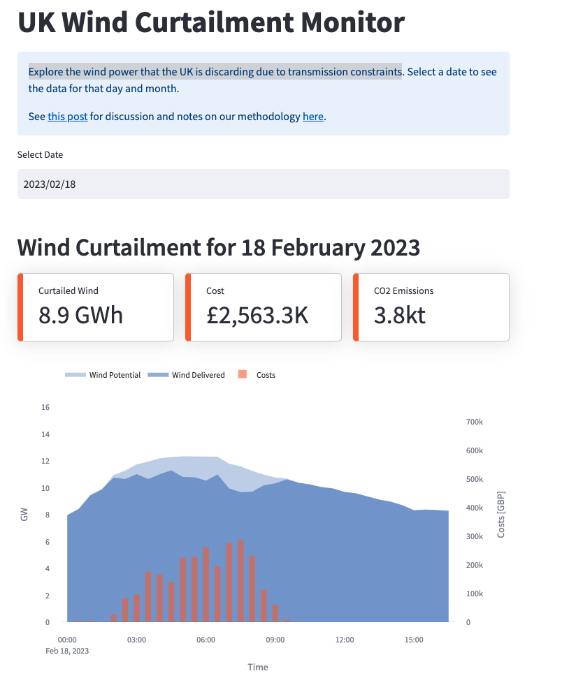

# UK Wind Curtailment Monitor

Exploring the wind power that the UK is discarding due to transmission constraints

[https://wind.axle.energy](https://wind.axle.energy/)

## Methodology

By pulling data from Elexon, we combine FPNs, BOALS, and BOD to see the effects of wind curtilament

More details are [here](https://wooden-knee-d53.notion.site/UK-Wind-Curtailment-Monitor-Methodology-71475d0b7cfd4edb97d6397b358f4118)

## Data
We use the Elexon API to get data. See `scripts/fetch_data.py`. This is saved to an SQLite DB. Note that raw data is also saved as `feather` files to `./data/PHYBM/raw`.

## Analysis
Run `scripts/calculate_curtailment.py` to run the analysis against the SQLite DB.

## Notebooks
There's some old analysis in `scripts` and `notebooks/curtailment.ipynb`,
mostly useful for identifying the right day to focus on.

Prototype is in `notebooks/bidoffer.ipynb`.

Might need to run
`export PYTHONPATH=${PYTHONPATH}:/lib`
to get the lib in to your python path

## App
simple streamlit app can be run using
`streamlit run main.py`

## ETL

Fast API app that can be called to fetch data from Elexon and save to a database. 

## Deployment
App is deployed via GH Actions to GCP Cloud Run.

In the Github [workflow](./.github/workflows/deploy.yaml) 
- `env/.env.prod` file is made (DB_PASSWORD is saved in `Secrets > Actions` in Github)
- the Docker image is built, 
- pushed to container registry,
- a new cloud run revision is initialized against the updated image.
- This is done for both the `app` and the `etl`

Depends upon a single deploy secret (GLOUD_AUTH) which is in `Secrets > Actions` in Github, and is a base64 encoded
version of the default service account credentials in GCP.

## FAQs

### BM units
Q: How do we make sure new BM units are being used?

A: We have a Github actions that runs once a month. This adds any new BM units to a PR which can then be merged in. 

Q: How can I get the data?

A: You can log on to the [app](https://wind.axle.energy/), and download the data at the bottom. If possible remember to site the data with the DOI above. 
